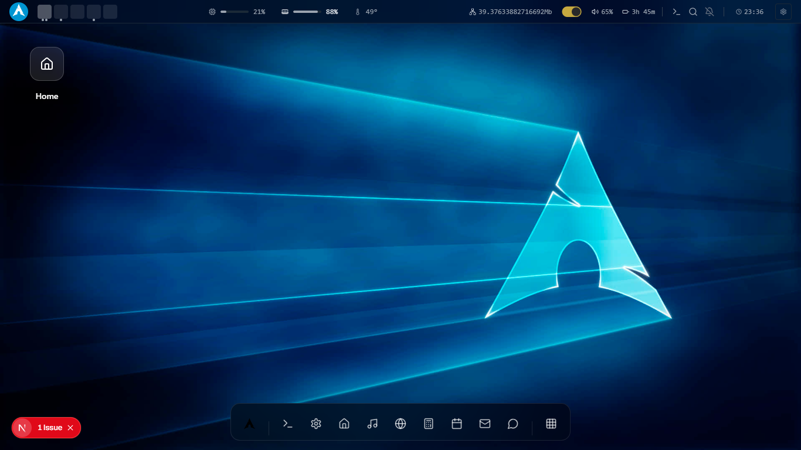
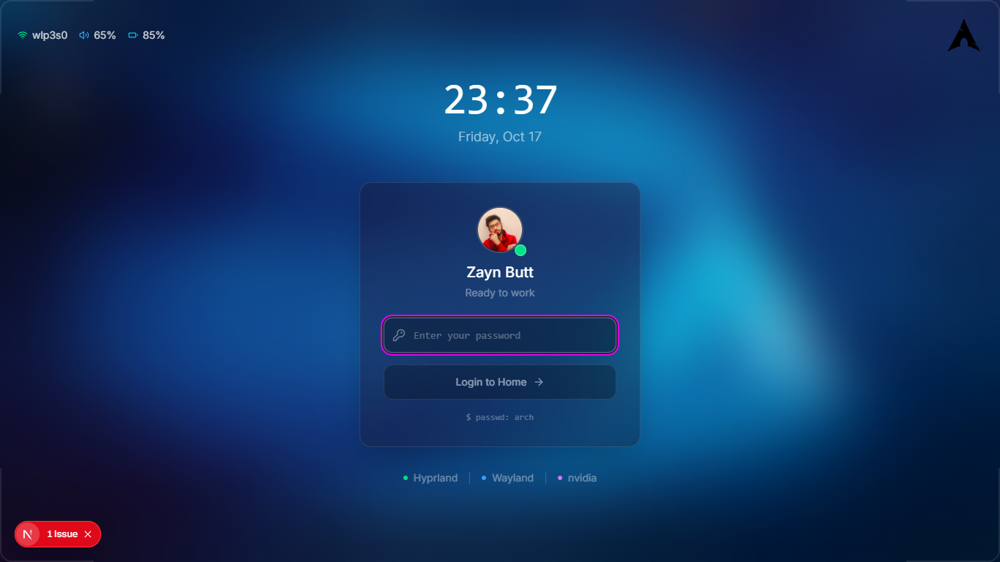

# 🐧 Linux OS Clone

<div align="center">

 # 🐧 Linux OS Desktop 
 <!-- Replace with actual screenshot -->


# 🐧 Linux OS Lock Screen
 <!-- Replace with actual screenshot -->


# 🐧 Linux OS Lock Neofetch terminal 
 <!-- Replace with actual screenshot -->


**A web-based Linux desktop environment with full desktop functionality**

[](https://your-linux-clone.vercel.app)
[](https://nextjs.org)
[](https://typescriptlang.org)

</div>

## ✨ Features

### 🖥️ Desktop Environment
- **Fully Interactive Desktop** with draggable, resizable windows
- **Start Menu/Application Launcher** with categorized apps
- **System Tray** with clock, notifications, and system controls
- **File Explorer** with directory navigation and file operations
- **Multiple Workspaces/Desktop Panels**

### 🛠️ System Applications
- **Terminal Emulator** with full command execution
- **Text Editor** with syntax highlighting
- **Calculator** with scientific functions
- **System Settings** with theme customization
- **Web Browser** (basic navigation)
- **Media Player** for audio/video files

### 🎮 Interactive Elements
- **Window Management** (minimize, maximize, close)
- **Drag & Drop** functionality across desktop
- **Right-click Context Menus**
- **Keyboard Shortcuts** (Alt+Tab, Super key, etc.)
- **Multiple Theme Support** (Light, Dark, Classic Linux)

## 🚀 Quick Start

### Prerequisites
- Node.js 18+ 
- npm, yarn, pnpm, or bun

### Installation

```bash
# Clone the repository
git clone https://github.com/hey-Zayn/linux-os-clone.git

# Navigate to project directory
cd linux-os-clone

# Install dependencies
npm install

# Start development server
npm run dev
