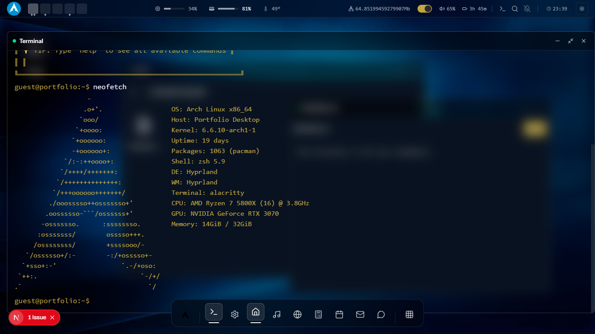

# 🐧 Linux OS Clone - Web-Based Desktop Environment

<div align="center">


**A fully functional Linux desktop environment built with Next.js 14 - Experience the power of Linux in your browser**

[](https://your-live-demo-link.vercel.app)
[](https://nextjs.org)
[](https://typescriptlang.org)
[](https://github.com/hey-Zayn)

</div>

## 📸 Screenshots

<div align="center">

| Desktop Environment | Lock Screen | Terminal |
|---------------------|-------------|----------|
|  |  |  |

| Start Menu | Applications | System Info |
|------------|--------------|-------------|
|  |  |  |

</div>


<div align="center">
  # 🐧 Linux OS Lockscreen password is "arch"
   
  
</div>

## ✨ Features

### 🖥️ Desktop Environment
- **Fully Interactive Desktop** with draggable, resizable windows
- **Start Menu/Application Launcher** with categorized apps
- **System Tray** with clock, notifications, and system controls
- **File Explorer** with directory navigation and file operations
- **Lock Screen** with authentication simulation
- **Multiple Workspaces/Desktop Panels**

### 🛠️ System Applications
- **Terminal Emulator** with full command execution
- **Text Editor** with syntax highlighting
- **Calculator** with scientific functions
- **System Settings** with theme customization
- **Application Launcher** with categorized programs
- **System Monitor** with performance metrics

### 🎮 Interactive Elements
- **Window Management** (minimize, maximize, close)
- **Drag & Drop** functionality across desktop
- **Right-click Context Menus**
- **Keyboard Shortcuts** (Alt+Tab, Super key, etc.)
- **Multiple Theme Support** (Light, Dark, Classic Linux)
- **Real-time Command Execution**

## 🚀 Quick Start

### Prerequisites
- **Node.js** 18 or higher
- **npm**, **yarn**, **pnpm**, or **bun**

### Installation & Development

```bash
# Clone the repository
git clone https://github.com/hey-Zayn/linux-os-clone.git

# Navigate to project directory
cd linux-os-clone

# Install dependencies
npm install


# Start development server
npm run dev


````

💻 Terminal Commands

System Commands:
```
neofetch      # Display system specifications and info
help          # Show all available commands
about         # Learn about the developer
skills        # View technical skills and technologies
projects      # Explore completed projects
banner        # Display welcome banner
contact       # Get contact information
clear         # Clear terminal screen
```

# File System Commands : 
```
ls            # List directory contents
cd [dir]      # Change directory
pwd           # Print working directory
cat [file]    # Display file content
```


# 🛠️ Tech Stack: 


Framework: Next.js 14 (App Router)

Language: TypeScript

Styling: Tailwind CSS + Custom CSS

State Management: React Context + Custom Hooks

Icons: Lucide React + Custom SVG


# Usage Guide
Desktop Interaction

Click on desktop icons to launch applications

Use the start menu (bottom left) to access all apps

Drag windows to move them around the desktop


# 👨‍💻 Author
Zain ul Abideen

Portfolio: portfolio-terminal-self.vercel.app

GitHub: @hey-Zayn

LinkedIn: https://www.linkedin.com/in/zayn-butt/

Email: zaynobusiness@gmail.com

# 🙏 Acknowledgments
Inspired by classic Linux desktop environments (GNOME, KDE)

Linux community for continuous inspiration

Next.js team for the amazing framework

Open-source contributors worldwide


<div align="center">
# ⭐ If you find this project interesting, don't forget to give it a star!
"Simulating complex systems to master web technologies"

</div> 

